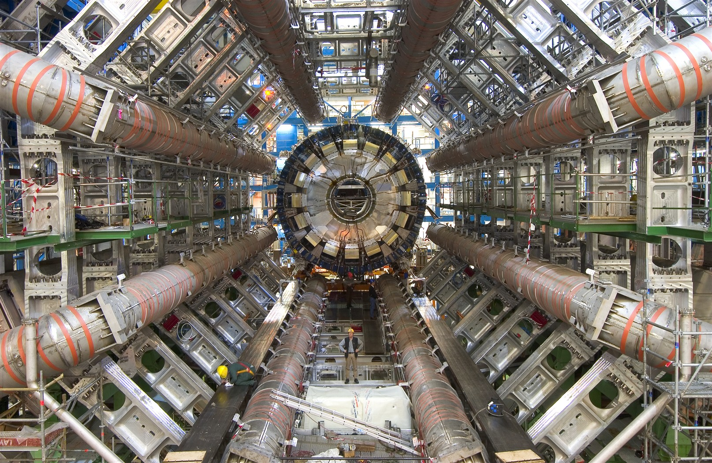
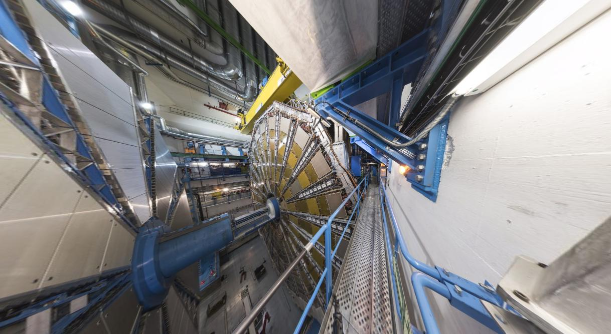
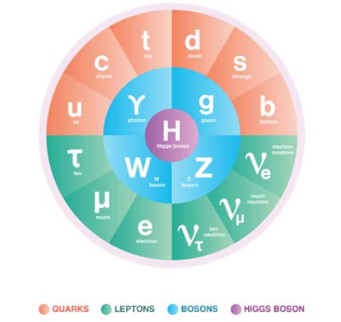
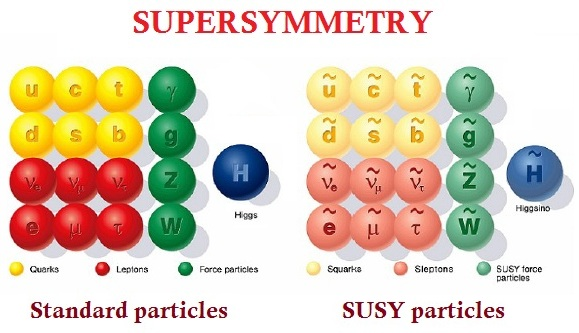
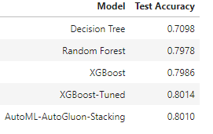
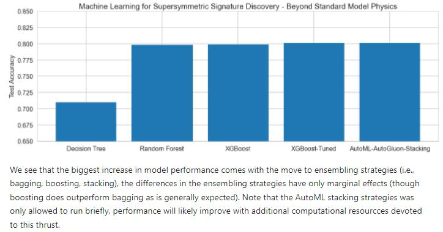

# Discovering-Beyond-Standard-Model-Physics-with-Machine-Learning---Supersymmetry
Identifying simulated supersymmetry signatures using machine learning strategies

<figure>

<figcaption align = "center"><b>The ATLAS Detector at Large Hadron Collider at CERN in Geneva, Switzerland, supersymmetry could have been discovered at ATLAS but this possibility has become increasingly unlikely over time as supersymmetry continues to elude experimental confirmation. </b></figcaption>

</figure>

Supersymmetry: The Dream and the Current Reality
Supersymmetry has been the dream of a generation of physicists, promising to fix vexing problems with the Standard Model of Particle Physics including the small observed Higgs mass, providing a promising dark matter candidate, and doing useful things for the unification energy of 3 of the fundamental forces. The failure of supersymmetric particles to manifest in experimental searches at the LHC has thrust particle physics into an era of crisis and reassessment.

There has always been some skepticism surrounding supersymmetry. Here is Roger Penrose in his 2004 book,

"I have found myself to be totally unconvinced of the physical relevance of the scheme of supersymmetry, at least in the form employed in particle physics and underlying theories today." (Penrose, Roger. The road to reality: A complete guide to the laws of the universe. Random house, 2005, page 873)

However, the mainstream of particle physics certainly had (and continue to have in many cases) high hopes for supersymmetry. Stanford particle physicist Michael Peskin echoes the thoughts of many in the physics community in saying,

"“I was shocked when supersymmetric particles were not discovered in the early days of the    
LHC." (Symmetry Magazine, The Status of Supersymmetry, 1/21/2021).

Nevertheless, the same Symmetry Magazine article notes,

The simplest supersymmetric theories—those that best explain the Higgs boson—predict a zoo of new particles with masses comparable to those of the W and Z bosons. Those were within reach of the Large Hadron Collider, so when it turned on in 2009, many particle physicists thought the discovery of super-partners was imminent. But after the triumphant discovery of the Higgs boson came … no more new fundamental particles.

Fortunately for us, we can use the power of Monte Carlo simulation to work out what machine learning strategies and algorithms would have been most successful in detecting supersymmetry signatures in the LHC data if they had manifest. In this notebook we work with a dataset of simulated supersymmetry signatures and train machine learning models to detect the Beyond Standard Model (BSM) physics supersymmetric particles would represent.

We use the "SUSY" dataset from this paper (take a look at the paper for the details on the Monte Carlo simulations for data generation and many interesting discussions on Supersymmetry and Higgs physics as well).

Baldi, Pierre, Peter Sadowski, and Daniel Whiteson. "Searching for exotic particles in high-energy physics with deep learning." Nature communications 5, no. 1 (2014): 1-9.

The Standard Model is an amazing creation of human creativity and tenacity, the most successful physical theory in human history by far. It deeply explains almost everything we see around us on a day to day basis. However, it cannot be the final word from Nature as glaring ommissions and anomalies have become clearer in recent years.

Supersymmetry matches every particle in the Standard Model with a superpartner, unifying fermions and bosons in a surprising new symmetry.

The results of our studies are promising, but more work remains to increase the accuracy of SUSY signature detection beyond the current plateau around an accuracy of 0.80 that we see. 

A final thought from Frank Wilczek:

"Supersymmetry was (and is) a beautiful mathematical idea. The problem with applying supersymmetry is that it is too good for this world. We simply do not find particles of the sort it predicts. We do not, for example, see particles with the same charge and mass as electrons, but a different amount of spin. However, symmetry principles that might help to unify fundamental physics are hard to come by, so theoretical physicists do not give up on them easily." (Wilczek, Frank. The lightness of being: Mass, ether, and the unification of forces. Basic Books (AZ), 2008.) 

